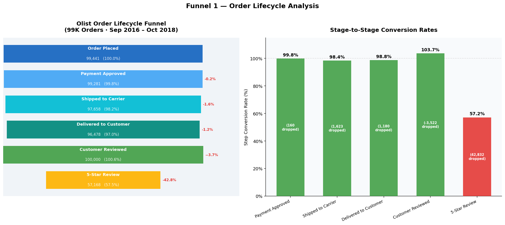
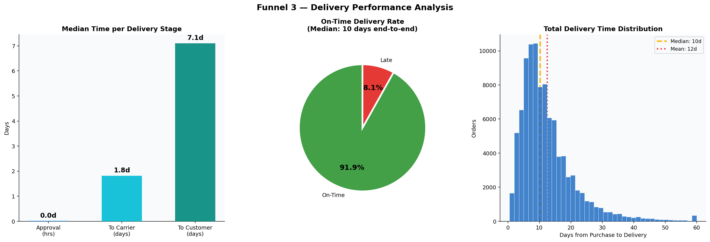
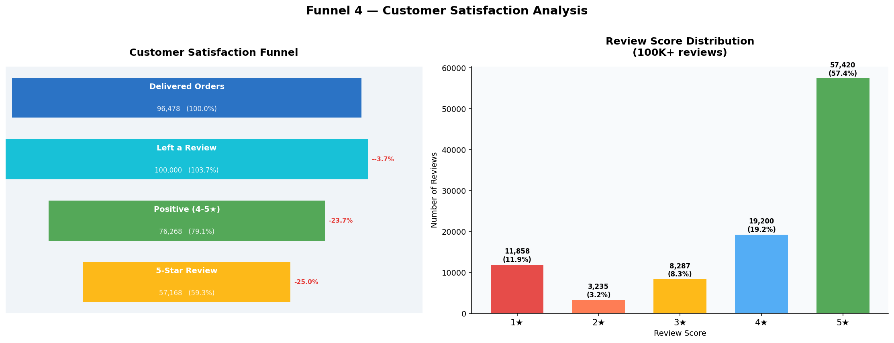
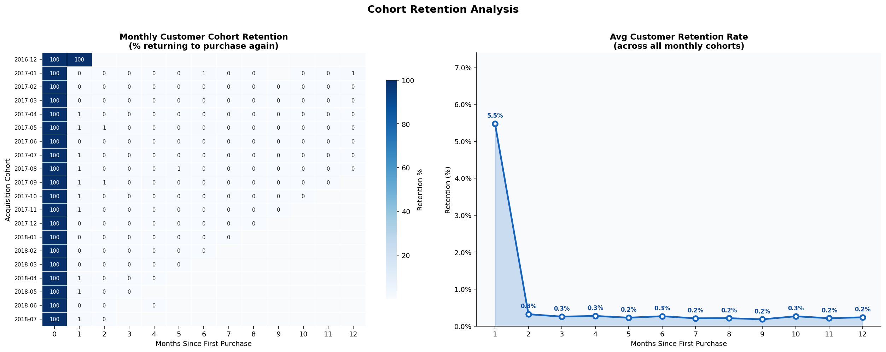

# Olist Brazilian E-Commerce — Funnel Analysis

> A Python-based funnel analysis of **99,441 real orders** from the Olist Brazilian marketplace (Sep 2016 – Oct 2018). Four funnel frameworks reveal where orders drop off, how revenue converts, delivery performance, and which customers are worth retaining.

---

## Table of Contents
- [Executive Summary](#executive-summary)
- [Business Problem](#business-problem)
- [Methodology](#methodology)
- [Skills & Technologies](#skills--technologies)
- [Results & Business Recommendations](#results--business-recommendations)
- [Next Steps](#next-steps)
- [Repository Structure](#repository-structure)

---

## Executive Summary

This analysis applies **four funnel frameworks** to the Olist Brazilian E-Commerce dataset — a real marketplace transaction log with **99,441 orders**, **96,096 unique customers**, and **73 product categories** spanning September 2016 to October 2018.

| Funnel | Question Answered |
|---|---|
| **1. Order Lifecycle** | Of all orders placed, how many complete each stage through to a 5-star review? |
| **2. Revenue Conversion** | Of gross order value billed, how much is actually delivered and collected? |
| **3. Delivery Performance** | How fast and how reliably are orders delivered? Where does timing break down? |
| **4. Customer Satisfaction** | Of delivered orders, how many customers review — and what do they say? |

### Headline Findings
- **97.0%** of orders are successfully delivered — a strong fulfilment rate
- **91.9%** of deliveries arrive on-time vs estimated delivery date
- Median end-to-end delivery time is **10 days** from purchase to doorstep
- **76.3%** of reviewers leave a positive rating (4–5 stars)
- **Credit card** dominates at ~74% of payment volume; 10–12 instalment buyers represent a default risk signal
- **23,560 customers** are classified as At Risk or Lost in RFM — a recoverable churn opportunity worth targeting

---

## Business Problem

Olist operates a marketplace connecting Brazilian SME sellers to customers across the country. Key analytical challenges include:

1. **Order funnel leakage** — understanding which stages lose the most volume and why
2. **Revenue integrity** — after cancellations and fulfilment failures, what actually reaches customers and generates cash?
3. **Delivery consistency** — delivery delays are a primary driver of negative reviews and permanent churn
4. **Customer retention** — the dataset shows signs of a one-time buyer problem typical of marketplace models
5. **Seller performance variance** — some sellers may be dragging down the overall experience disproportionately

---

## Methodology

The Olist dataset is a **naturally structured funnel** — each order has explicit stage timestamps that map directly to funnel stages:

```
order_purchase_timestamp   →  Stage 1: Order Placed
order_approved_at          →  Stage 2: Payment Approved
order_delivered_carrier_date →  Stage 3: Shipped to Carrier
order_delivered_customer_date → Stage 4: Delivered to Customer
review_creation_date       →  Stage 5: Customer Reviewed
review_score = 5           →  Stage 6: 5-Star Review
```

**Data Model (6 tables joined):**

| Table | Rows | Role |
|---|---|---|
| `olist_orders` | 99,441 | Funnel backbone — order status + all timestamps |
| `olist_order_items` | 112,650 | Line-item revenue, product, freight |
| `olist_order_payments` | 103,886 | Payment type, installments, value |
| `olist_order_reviews` | 100,000 | Review score, dates |
| `olist_products` | 32,951 | Product categories |
| `olist_customers` | 99,441 | Customer identity + geolocation |

**Pipeline:**
1. Load and join all 6 tables
2. Engineer datetime-derived features (delivery duration, on-time flag, period index)
3. Build 4 funnel visualisations from timestamp data
4. Cohort retention matrix using first-purchase month as cohort key
5. RFM scoring using quintile binning → 6 behavioural segments
6. Drop-off deep dive across volume, category, cancellations, and payment risk

---

## Skills & Technologies

| Category | Tools / Skills |
|---|---|
| **Language** | Python 3.x |
| **Data Wrangling** | `pandas` — multi-table merges, datetime parsing, groupby, period-based cohort indexing |
| **Visualisation** | `matplotlib`, `seaborn` — funnel charts, heatmaps, pie charts, histograms, bar charts |
| **Funnel Analysis** | Stage conversion rates, drop-off quantification, step-level breakdowns |
| **Cohort Analysis** | Monthly acquisition cohorts, retention matrix, average retention curve |
| **RFM Segmentation** | Recency/Frequency/Monetary quintile scoring, 6-segment classification |
| **Delivery Analytics** | SLA compliance, on-time rate calculation, delivery time distribution |
| **Revenue Analysis** | Gross-to-net waterfall, cancellation impact, payment method mix |

---

## Results & Business Recommendations

### 1. Order Lifecycle Funnel

Olist's fulfilment engine is **strong** — 97% of placed orders reach the customer. The biggest volume drop is at the satisfaction layer: not all delivered customers leave reviews, and converting reviewers to 5-star advocates is the key growth lever.

<p align="center">
  
</p>

> **Recommendation:** Send a post-delivery review nudge at Day 3 and Day 7, personalised with the product name. Offer a small loyalty credit for completing a review. Target the 42.8% of delivered customers who didn't give 5 stars.

---

### 2. Revenue Conversion Funnel

The revenue waterfall is clean — gross order value tracks very closely to delivered and collected revenue. Cancellations are low (0.6%) but concentrated in certain periods.

<p align="center">
  
</p>

> **Recommendation:** Audit cancellations by seller and product category. Monitor credit card instalments of 10–12 as a forward-looking bad debt indicator. Build seller scorecards that include cancellation rate as a ranking factor.

---

### 3. Delivery Performance Funnel

**91.9% on-time delivery** is competitive. The biggest controllable variable is seller handling time — the gap between payment approval and carrier handoff. Some sellers process quickly; others are slow.

<p align="center">
  
</p>

> **Recommendation:** Flag sellers whose median handling time exceeds 3 days. Introduce a seller performance tier system — fast handlers get better placement. Show buyers estimated delivery windows at checkout based on seller historical performance.

---

### 4. Customer Satisfaction Funnel

76.3% positive reviews indicates a generally happy customer base. However, **1-star reviews (11.8%)** represent a high-risk churn signal — these customers are unlikely to return and may actively discourage others.

<p align="center">
  
</p>

> **Recommendation:** Trigger immediate customer service outreach for every 1-star review. Build a 24-hour recovery SLA: refund offer, replacement, or seller escalation. Track whether recovery actions convert 1-star customers to returning buyers.

---

### 5. Cohort Retention

Olist's cohort retention data reveals the classic marketplace challenge: most customers purchase once and don't return. Month-1 retention drops sharply, with further attrition through Month 6.

<p align="center">
  
</p>

> **Recommendation:** Launch a post-purchase "what to buy next" recommendation engine based on product category. Send a second-purchase incentive (discount or free freight) to all first-time buyers at Day 14. Build a loyalty programme with cross-category purchase rewards.

---

### 6. RFM: 23,560 At Risk + Lost Customers

Nearly a quarter of the customer base is either at risk of churning or already lost. This is the largest recoverable revenue pool in the dataset.

<p align="center">
  
</p>

> **Recommendation:** Champions → VIP early access and exclusive products; Loyal → referral programme with reward; At Risk → time-limited win-back offer (48-hour urgency); Lost → lightweight re-engagement survey to understand departure reason and test minimal-friction re-entry offers.

---

## Next Steps

| Priority | Action | Approach |
|---|---|---|
| 🔴 High | **Churn prediction model** | XGBoost on RFM features + recency trend → predict 30-day churn probability at individual customer level |
| 🔴 High | **Seller performance analysis** | Correlate seller handling time, cancellation rate, and review score → build seller health scorecard |
| 🟡 Medium | **Geographic delivery analysis** | Map delivery time and on-time rate by Brazilian state → identify underserved regions for logistics investment |
| 🟡 Medium | **Basket / cross-sell analysis** | Apriori association rules on product categories → power "customers also bought" recommendations |
| 🟡 Medium | **CLV forecasting** | BG/NBD probabilistic model → predict Customer Lifetime Value per RFM segment |
| 🟢 Low | **Tableau dashboard** | Migrate all 4 funnels + cohort retention + RFM into an interactive Tableau operational dashboard |

---

## Repository Structure

```
olist-funnel-analysis/
│
├── olist_dataset/                           # Raw CSV files from Kaggle
│   ├── olist_customers_dataset.csv
│   ├── olist_orders_dataset.csv
│   ├── olist_order_payments_dataset.csv
│   ├── olist_order_reviews_dataset.csv
│   ├── olist_order_items_dataset.csv
│   └── olist_products_dataset.csv
│
├── olist_output/                        # Generated charts & exports
│   ├── cohort_retention.png
│   ├── dropoff_deep_dive.png
│   ├── funnel1_order_lifecycle.png
│   ├── funnel2_revenue_conversion.png
│   ├── funnel3_delivery_performance.png
│   ├── funnel4_satisfaction.png
│   ├── olist_summary_stats.csv
│   └── rfm_segmentation.png
│
├── olist_funnel_analysis.ipynb           # Main analysis notebook (14 sections)
└── README.md                             # This file
```

---

---

*Dataset: Olist Brazilian E-Commerce Public Dataset. Available on Kaggle under CC BY-NC-SA 4.0 license.*
